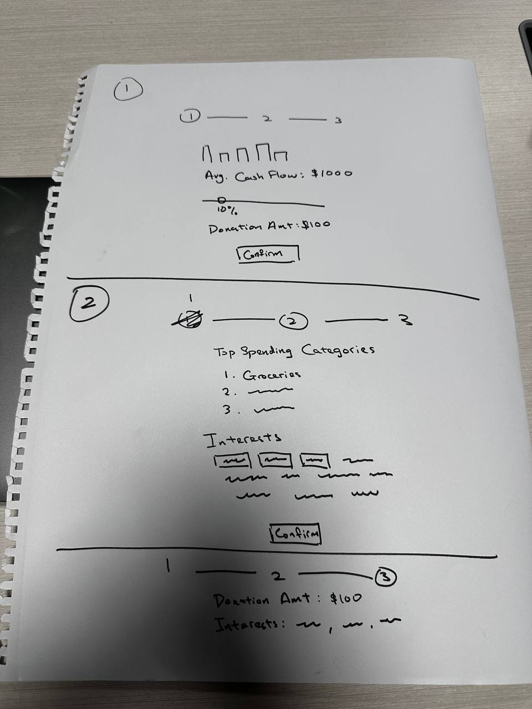
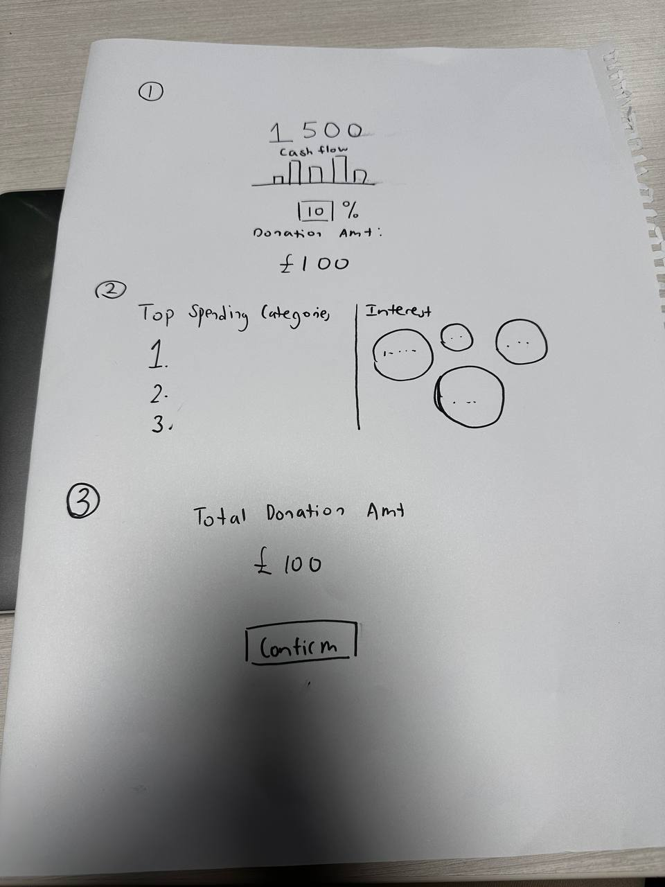

# Day 3
> 21 July 2023

### Designing Ideas
Designing is an iterative process where it is hard to get it right the first time. This is something we learned today and adopted a more open mindset to accept ideas from different people. We allow each other ideas to flow freely by drawing our different ideas on the drawing block. After explaining them, we saw our ideas converge into something better. 

### Idea 1

### Idea 2

### Idea 3

These are some of the images that the team sketched based on the knowledge of the designed donation process flow that the team had agreed on. It shows that different individuals have different views and expectations of the same donation process where the team came together to identify the features that should be added to our design for an improved process flow.

Upon reflection, we also understood the importance of the human touch. At the end of the day, humans are the one that uses technology. We created a prototyped to test our ideas with our friends and learned a lot about the different thinking processes of one another.

While it is not necessarily easy for them to convey their ideas across to us, we believe this is what makes us humans as we connect on a deeper level and saw better designs through this prototyping process.

And so today, we created a quote as a guiding light moving forward:
> #### *With high tech, we need high thought and high touch*