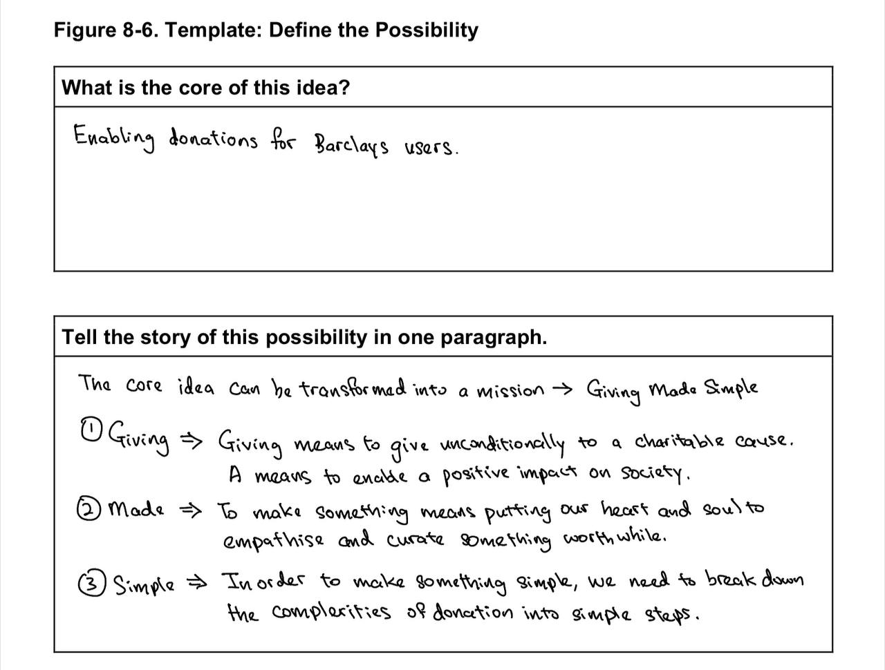
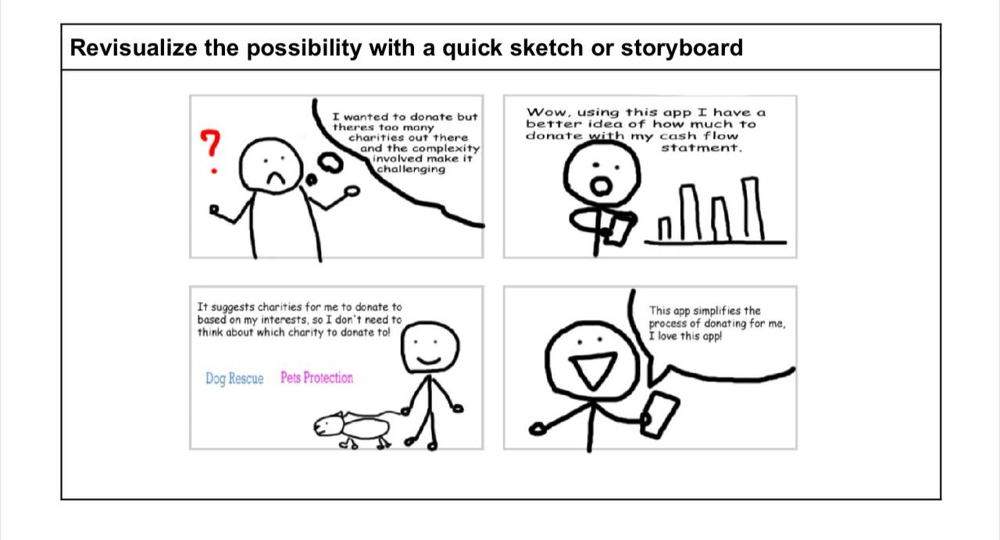

# Day 4
> 24 July 2023

### Re-Evaluating the Design Idea
As a continuation from last weeks reflection about “High tech requires high thought and high touch”, the feedback from Week 1’s pitch were very timeline. Today, we learnt the importance of feedbacks as a mean of disrupting our thinking process. After all, we are here to step out of our comfort zones, to tap into higher order thinking and truly empathise in the context of being in Scotland, Glasgow.

The feedback “Is marketing a landing page” got us thinking deeper about what’s really in it for Barclays and the stakeholders. While an app, in fact every app, can adopt the best design and coding practices, we start to realise that every business has its innate nature that may be not seen to others. No wonder the term “Users may know what they don’t want, but they won’t really know what they want” always comes up.

It is only through deeper thinking and empathy that innovative ideas will come to life. Today we unlearnt what we know about Barclays and started to rethink how we want to implement the app, again.

We also felt validated from the feedback that impact on charities is a key factor to get this idea accepted. As such, we started to see how Barclay’s users are an important “player” in this project as they are the ones to gain confidence in Barclays Bank and enables the charities involved to focus on their mission, since the donation money will come from them.

So what we did today was to define our mission of “Giving Made Simple” a little deeper and step into the user’s shoes to view the app in their perspectives.

### Template for Defining the Possibility 

We redefined what it means by “Giving Made Simple” as shown above.
### Storyboard 

The storyboard shows how users should feel when they interact with our app.

Moving forward this week, we see ourselves crystallising our ideas from the google forms prototype we did last week and creating some form of wire framing as well as diving deeper into the “What’s in it for me” question for Barclays, Users and Charities as we start our wire framing prototypes.

Some further ideas and questions for the rest of the week as we design our web application includes how we might want to empower users, how can we show that Barclays as an enabler for positive change in the society and how might we trigger “feel good” factors for all parties involved so that everyone wins.