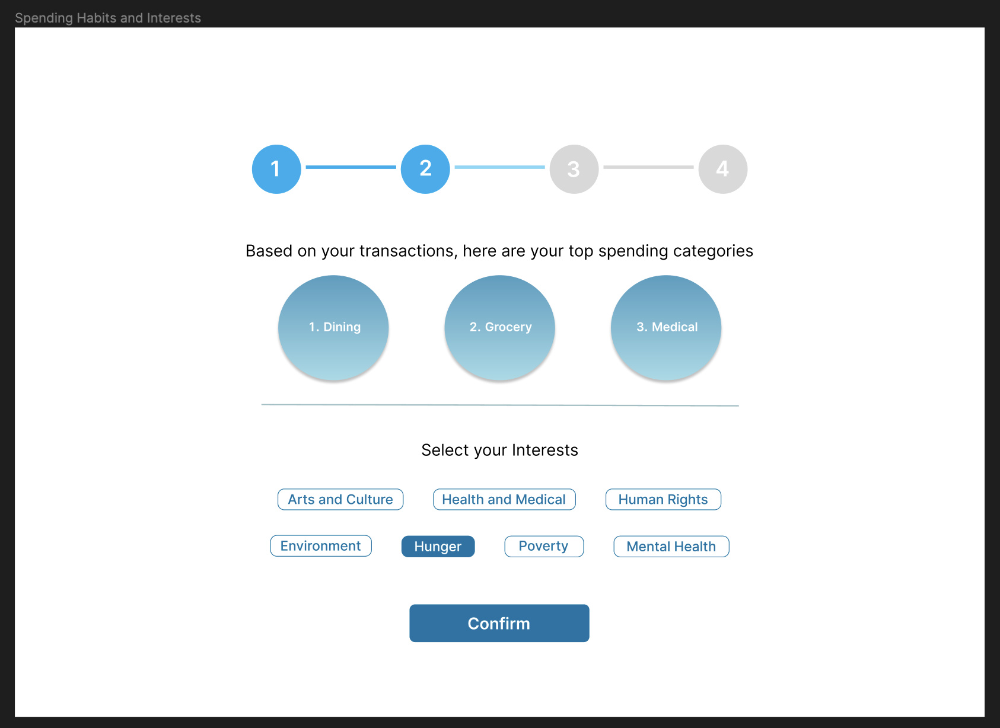
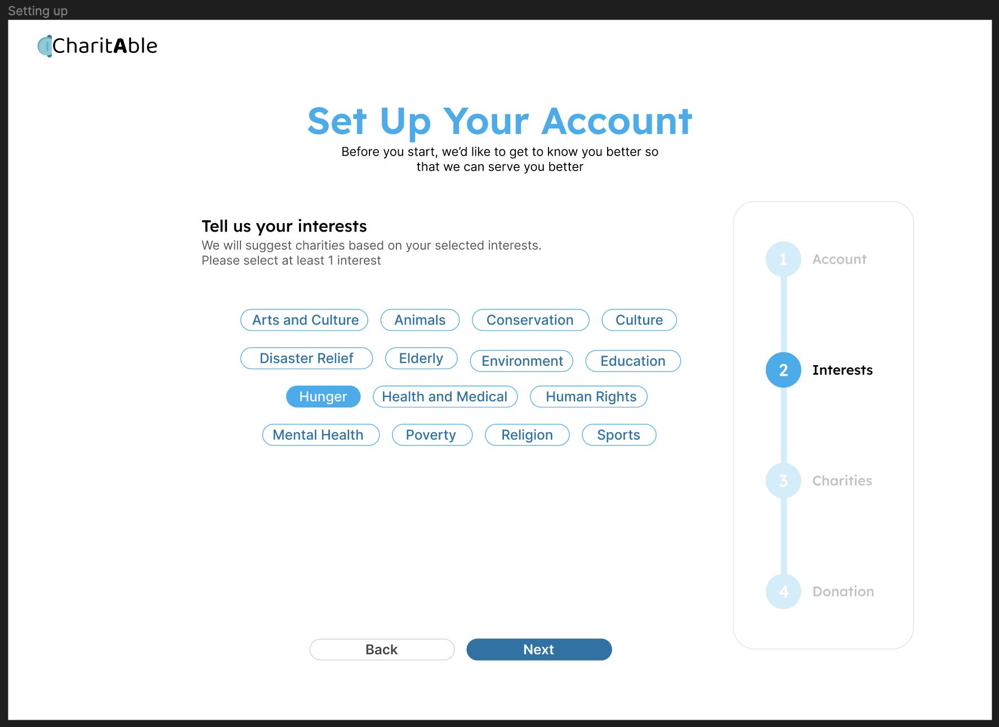

# Day 5
> 25 July 2023

### Creating our Prototype
During today’s lecture, we were introduced integrative thinking which were aligned with our reflections from yesterday.

We have multiple ideas which we can make use of integrative thinking to combine and make something better.

So we started designing our prototype on figma to test out our application on the design front. We decided to move forward with designing different ideas instead of coming to a common consensus first.

This is because we know the design will not be final and it will keep changing as new ideas will come along with different designs. We also view design as a communication tool, however it may not be something that can be communicated as clearly as words, just like how art can inspire although it may contain no words.

If the donation process and framework is the science behind the app, our design is the art. And at the end of they day, the art and science needs to meet to create something meaningful and inspiring.

Below are some figma prototypes stemming from different ideas 

### First Design Prototype

The above image shows the users top spending categories and allow them to select their interest.

### Second Design Prototype

While this image shows all the interests with pre selected interests for the users, they are definitely opposable and moving forward, we will use integrative thinking to combine these ideas.