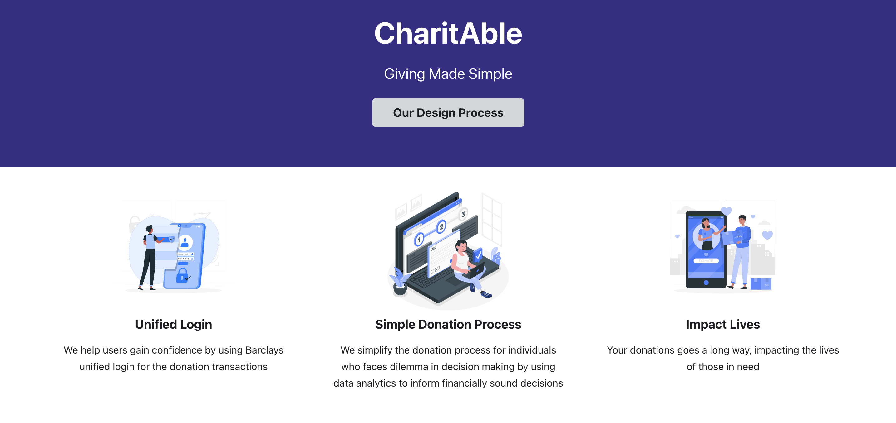
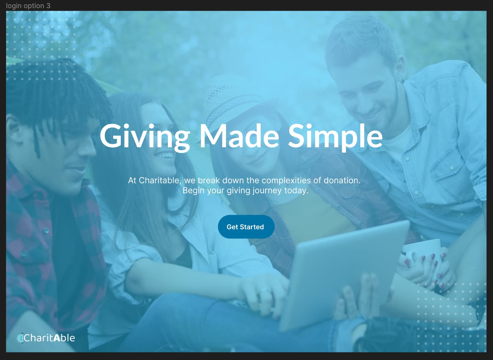

# Day 6
> 26 July 2023

### Creating the Static Website
As we are thinking about writing dailies today, we start to observe some patterns in our previous dailies and questioned the purpose of journaling our work. Aside from having to do it, we reframed it to a question “What will we get out of writing dailies?”

Looking at our previous dailies, we saw some insights we made previously that would have dearly be forgotten if we have not written it down. Insights in both our project and personal development, from the way we approach our work to the mindset we bring along with it, are both important aspects.

This process helped us to learn and grow as a person, as well as capturing new knowledge in words, to expand our capabilities and understanding as designers. It also made us think about how we are using the knowledge to tackle challenges and solve problems. So from today onwards, we will make use of a template, a way we think helps us best capture our daily work, learnings and growth.

### Tasks Accomplished

- Donation Process Figma: We created a prototype on figma capturing the entire process of signing up for the donation service
- Landing Page: Figma design for our landing page
- Static website: We start researching into static websites and found out many solutions out there that help with documentation
- Dailies: Changing how we view writing dailies as an opportunity to journal and reflect upon the day’s work
### New Concepts/Technologies Learned

- Docusaurus: Exploring a new framework to create beautiful static website
- Landing Page Conversion: How might we create an engaging landing page that would attract users
- Figma: We explore how we might fully utilise the features on figma to allow us to create a more seamless and efficient user experience for our application 

### First Design of Static Website

This is a working prototype of our static website built using Docusaurus.

### First Design of Landing Page

This is the first prototype of our landing page, incorporating the Barclays corporate colours.

### Challenges Faced

1. Team Dynamics: We all have personal learnings and there must be a way to bring our learnings together.
- Reflection: By introducing a dailies template, our team will be able to collective share our learnings and showcase it to others effectively.
2. OS Differences: Team uses both Mac and Windows. This posed some development challenges.
- Reflection: The way to solve this issue is to communicate with one another and voicing out our concerns. A team meeting may be essential to ensure that everything is right on track. We faced issues with Vuepress and soon after we switched to Docusaurus which solved our issues.
3. Differing Ideas: We came up with different ideas but we weren’t sure which one we should go with
- Reflection: all the ideas that we had and came up with were good and met the requirements so we weren’t really sure which one to go for. so we had a walkthrough of each prototype as new users and we found that one had a better UX than the others so we went with that

### Key Learnings

- Landing Page Elements: Landing page requires a few core elements to make it engaging

- Practice makes perfect: We learnt that its ok to do the same thing over and over again in different ways because theres always better ways to do something and theres always room for improvement even if its just small.

### Reflections

Many thoughts comes up during the day, some are helpful and some are negative. Using a template as a guide to journal our daily activities became imperative as we keep on growing. Problems may also occur and the way to learn is to reflect upon them make sure we grow from it.

On the design front, it is important to evaluate and look in the perspective of users to create something user friendly while designing. Once again, technology is made for users. We need to humanise technology.

Overall, we that think the entire team worked well together in deciding what to do and how we should move on from there and keeping each other on track.

### Plans for the Next Day

Continue our exploration for landing page and static website. The next tasks would be focusing on the process that comes after signing up. We will be focusing on the landing page, home page and other pages that will be required.

