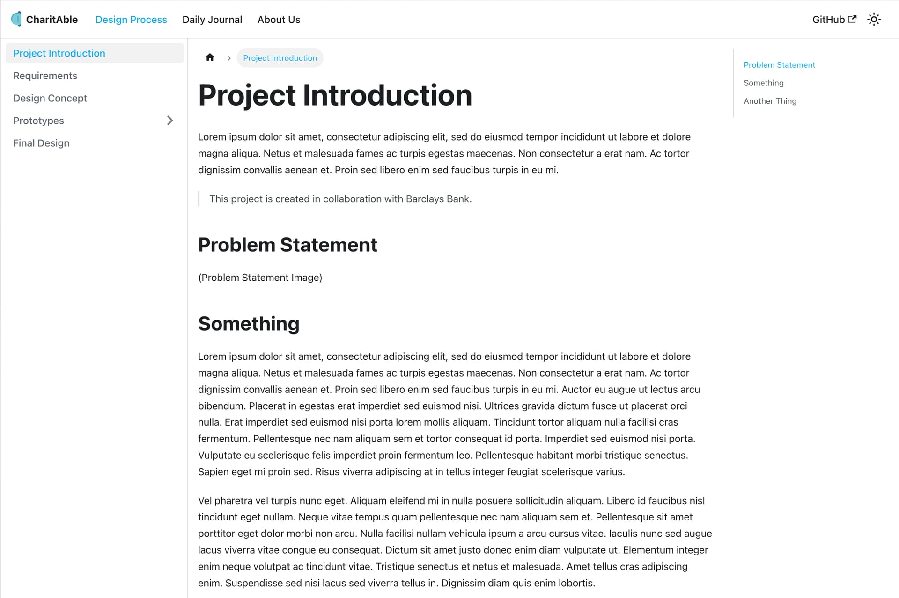
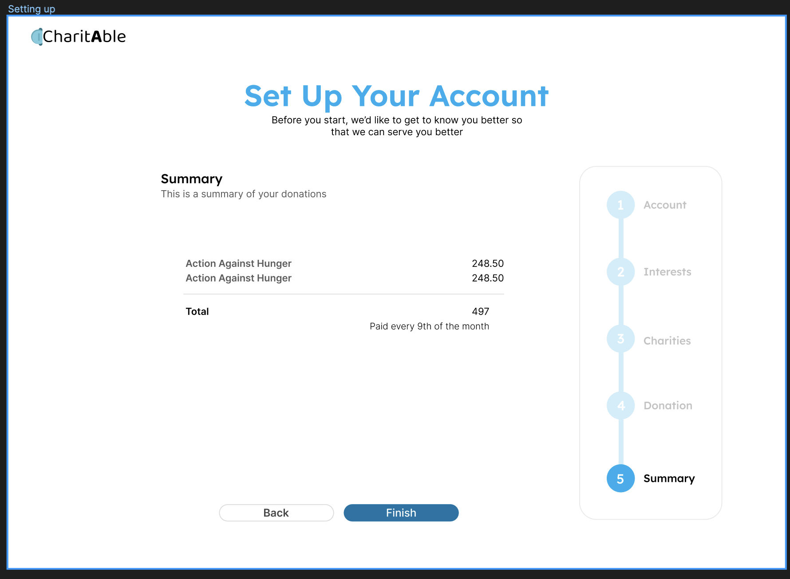
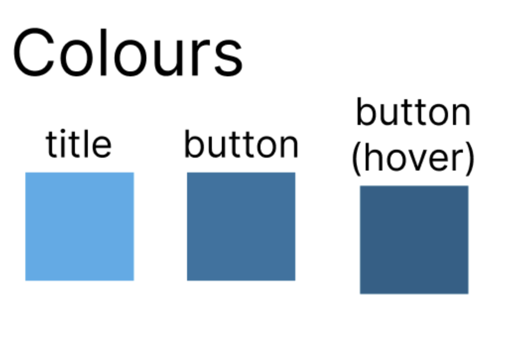

# Day 7
> 27 July 2023

### Improving the Static Website
Today’s work is a huge mix of discovery in both Docusaurus (our choice for static website) and Figma.

### Tasks Accomplished

1. Configuring Docusaurus: This involved familiarising with the file structure and format of the open-source website generator.
2. Structuring Content on Docsaurus: Coding out and structuring the static website to help best showcase our design journey.
3. Landing Page: Linkage and flow of pages in figma

### New Concepts/Technologies Learned:

- Distinct Separation (Docusaurus Content): Separating our design process into multiple distinct sections helps users to navigate comfortably without feeling too overwhelmed.

- Pictures Speaks a Thousand Words (Figma): We learnt that wordy text will put off a user from reading so we need to try to engage them with lesser words and more visuals

- Interaction: Interactive prototype in figma
### Challenges Faced

1. How Docusaurus Works: Bought into the concept that the content and code is clearly separated and it will be easy to set up. But it took a substantial amount of time to make it work.
- Reflection: Having web development skills and translating it to new platforms seems challenging as I was still stuck in an old paradigm. But after further experimenting, it became comfortable working with Docusaurus once we get the set up out of the way. From tomorrow onwards, we can start focusing on content.
2. Tabs in Docusaurus: We encountered challenges implementing multiple tabs on the website. Initially, we created a React.js file named about.js and manually linked it, followed by creating a Markdown file in the pages folder. However, through further research, we discovered that Docusaurus automatically generates a sidebar based on the docs folder. All Markdown files in this folder are automatically indexed and displayed on the sidebar. We then created additional folders for each tab, and configured it to link it to the navigation bar.
- Reflection: We learned how to configure multiple instances of the docs folder to create separate tabs on the website’s navbar. We saw how Docusaurus is a powerful tool that blends the two together.
3. Copywriting: We found it challenging to finding the words for the description that accurately describes what the website is for to the users.
- Reflection: It was hard because we already had an established mental model of how the website works and we found it difficult to put it into words for new users

### Key Learnings

- Utilizing Built-in Features: The experience in configuring Docusaurus taught us the importance of thoroughly exploring documentation and built-in features of tools before implementing custom solutions. This not only saves time but also ensures a more streamlined development process.

- Flexibility and Adaptability: The challenge with multiple tabs pushed us to adapt and find alternative solutions. Embracing flexibility is crucial in a dynamic project environment.

- Catering to Multiple People: We learnt that not everyone will have the same understanding that we do and that we have to explain and do things in a way that is digestable for everyone

- Website Simulation: Making use of interactive components to create simple animations that mimic a real website for the prototype

### Reflections

Today’s experience was productive. While challenges were faced, we manage to find optimal solutions that enhances our team’s efficiency in creating content for the static website. Going forward, we aim to approach tasks through more in-depth exploration of available features and documentation to prevent unnecessary detours in the development process. Furthermore, online resources are always around when facing challenges in both static website and figma!

### Plans for the Next Day

Now that the configuration for static website is done, we will collaborate to populate our static website with content. As for figma, we plan to do the remaining pages of the website such as history page, user account page and see if there are any pages we need to include and work on as well.

### Introduction Page of Static Website

The above is the static website we baked today for the different tabs and structuring the sidebar. We also incorporated an icon and Barclays corporate colours to enhance the look and feel.

### Summary of Donation Process for Application

Finishing up the donation process and including a summary page for better UX.

### Colours Used for Application

The above shows the colour palette we used for our application where we aim to use the colours similar to the current Barclays App as users are most comfortable with these colours.