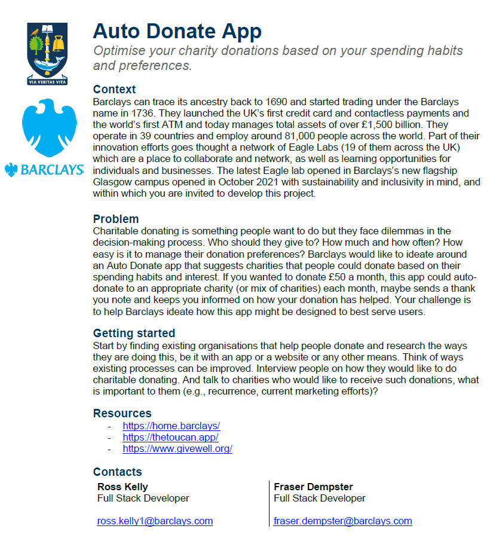

# Project Overview

## Project Brief
> *This project is created in collaboration with Barclays Bank*

## Project Introduction

Welcome to Charitable, an innovative and transformative web application designed to revolutionize the process of donating to charities. Throughout this project, the team will explore various stages and processes required to build a remarkable web application, ensuring a seamless and intuitive experience for the users. 

First, the team will start with the problem statement where it will provide a clear view of the web application's purpose and the problem it aims to solves. Next, requirements will be gathered, ensuring a clear outline of what the application aims to achieve such as its functionalities and features. Thereafter, market research will be conducted to analyze current donation applications in the market and identify potential partner organizations for the application.  

Information architecture will be the next stage where it will define the structure and navigation of the application such as the organization of charities and donation options. Storyboards and Prototypes will then be created, showcasing the key pages such as the donation process. This will allow the team to obtain user feedbacks and improve the design of the application.

To gain a deeper understanding of the user experience, the team will embark on a comprehensive user journey mapping exercise. By empathizing with the users, the team can uncover valuable insights, optimizing the application for enhanced usability and satisfaction. Thereafter, the team will present the visual design of the application and provide an explanation for the choices. Upon presenting the visual design which is the final design, launch and marketing will be the next stage where it will include strategizing a plan to reach potential users and partner organizations.

Future enhancements will also be discussed, incorporating user feedbacks and adapting to market trends to enhance the app's functionality and purpose. Thereafter, conclusion will be written to discuss the overall design process and project experience. The final phase of the project will be a reflection written by the team, reflecting on the entire design journey from the inception to implementation. 
## Problem Statement
Despite being keen to make a donation, many encountered dilemmas in the decision-making process such as the amount, the charity and frequency which eventually resulted in the idea being scrapped. This is where Barclays comes into the picture to ideate around an Auto Donate application that would suggest charities and the donation amount to individuals based on the spending habits and interests. This aims to provide individuals with a simplistic donation process which may encourage donations for a greater cause.

