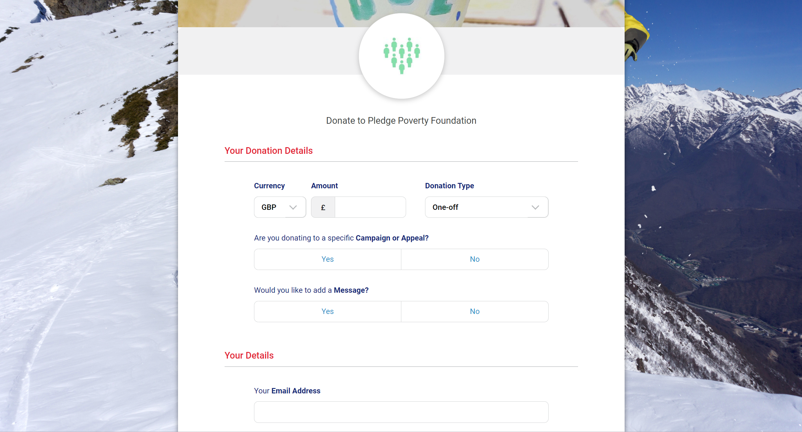
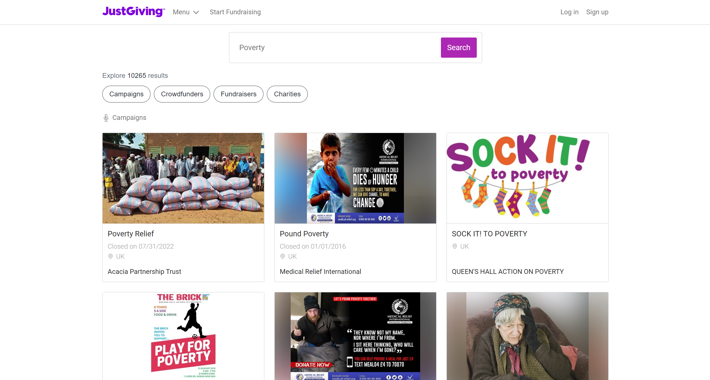
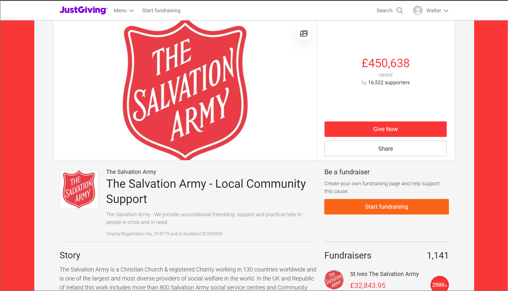

# Market Research
After understanding the project requirements in detail, the team proceeded to conduct market research to gain insights into existing platforms and the pain points of the target audiences. This research was done before designing a viable solution that also addresses the pain points encountered during the process.

## Charitable Donations Platforms
[<h2>1. TotalGiving</h2>](https://www.totalgiving.co.uk/)

TotalGiving is an online fundraising platform that allows donors to donate directly to the charities that they are passionate of. However, it does not provide a list of available charities for donors to choose from which indicates that the donors have to search for the desired charities to make a donation and be well aware of the charity's causes and activities as it lacks description of the charity's activities and mission. Donors can donate any amount that they wish to donate.

[<h2>2. JustGiving</h2>](https://www.justgiving.com/)

JustGiving is an online giving platform that has raised over £6 billion for charities since its establishment in 2000.Donors can start fundraisers or contribute to existing ones while having the flexibility to donate an amount of their choice. The platform provides donors with a description of the charity's mission and purpose, giving more information about the cause they are supporting. 

Overall, these platforms provide donors with the ability to donate to various charities and fundraisers on a single platform, reducing the hassle of researching charities that cater to their desired causes. However, these platforms do not assist donors in making financially sound decisions for the donation amounts or prevent the dilemma that most donors encounter while deciding which charity to donate to. They also do not allow donors to allocate their donation amounts across different charities. Therefore, the Auto Donate Application aims to provide donors with a simplified donation process where both the donation amount and charities will be suggested to aid in decision-making.

## Partner Organisations
Barclays actively supports communities in need to deliver vital relief efforts to people most in need. For example, Barclays launched a Covid-19 Community Aid Package back in April 2020 and to date, have given support to more than 370 charity partners around the world. Some of the charities that barclays support are as follows:

[<h3>1. Action Against Hunger</h3>](https://www.actionagainsthunger.org.uk/)

Action Against Hunger is a charitable organisation that managed to support more than 25 million people around the world, transforming lives in some of the most vulnerable communities in 51 countries around the world. Action Against Hunger focuses on preventing life-threatening hunger by assisting communities in providing clean water, sanitation, self-sustaining food sources etc.

[<h3>2. World Central Kitchen</h3>](https://wck.org/)
World Central Kitchen is devoted to providing meals in response to humanitarian, climate, and community crises. World Central Kitchen is guided by their belief that food is a universal human right and has served hundreds of millions of nourishing meals around the world. 