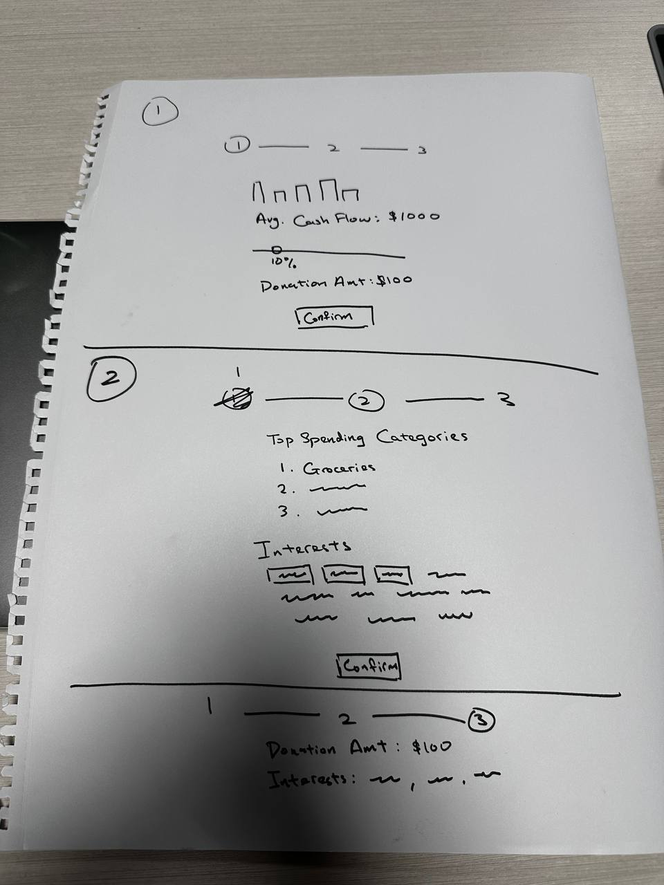
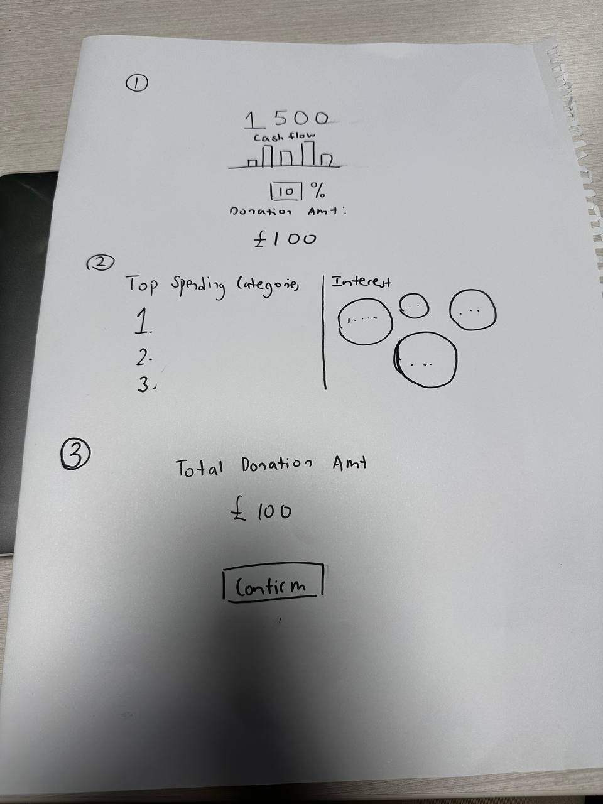
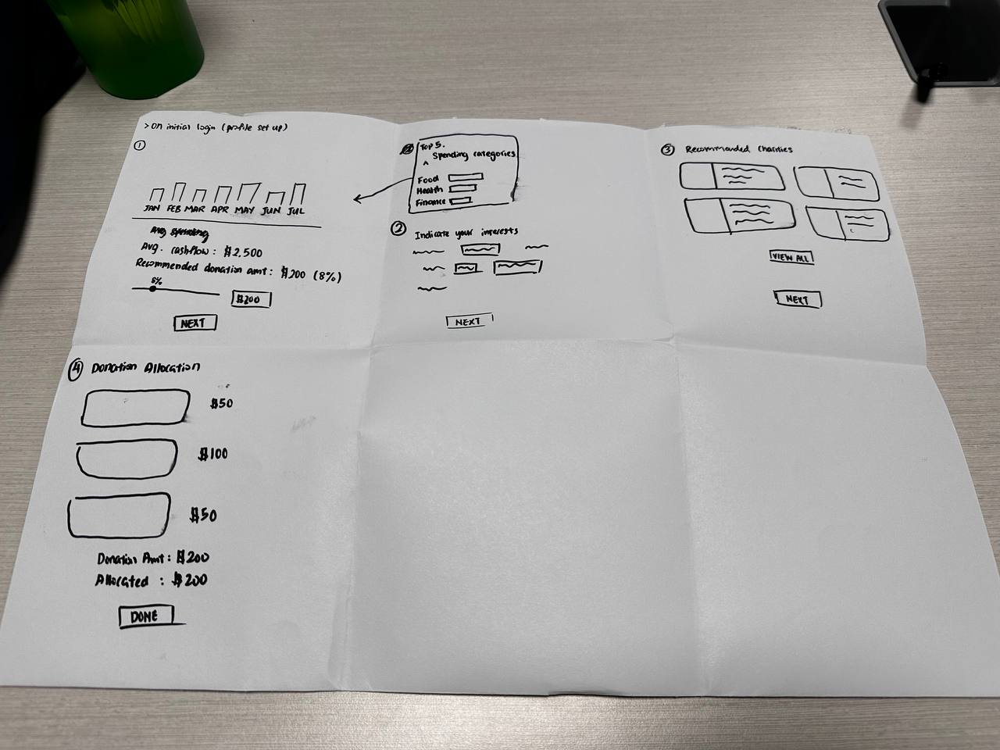

# Prototype 2

## Low-Fidelity Prototype
### Designing the Donation Process Idea
Having successfully tested the design idea in the first prototype, the team is now prepared to begin the application's actual design for the donation process. Commencing the creative process, the team engaged in brainstorming sessions to explore various designs to depict the donation process within the application. The team opted for a low-fidelity prototype using A3 paper to sketch and visualize the concepts for the donation process. Ultimately, three similar yet distinct ideas for the application were drawn.
### Idea 1

### Idea 2

### Idea 3

### Conclusion of Prototype 
After drawing the three different ideas, the team sought feedback from several users to assess the designs. The majority of users expressed satisfaction and could envision how the designs would translate into an actual application layout. By completing the low-fidelity prototype using A3 paper, the team has gained a rough idea of the application's design. The valuable insights gained from user feedback and the creative brainstorming sessions have paved the way for the next phase of the project.