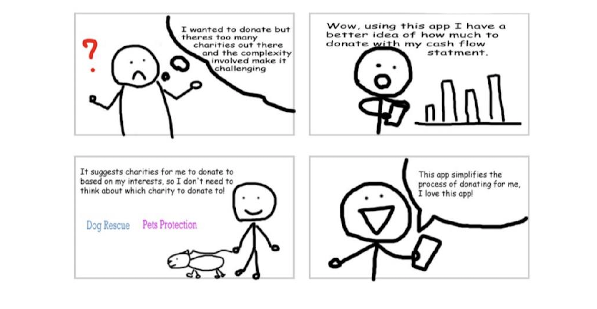

# Storyboard

## Tagline
Before creating the storyboard, the team took a thoughtful approach by crafting a compelling tagline for CharitAble. Recognising the importance of a clear and concise message, brainstorming sessions were carried out to conceive a tagline that encapsulated the essence of the team's vision. This initial step was crucial in establishing the project's direction and ensuring that the storyboard seamlessly aligned with the core message the team aimed to convey. After careful deliberation, the team decided on "Giving Made Simple". The idea was built with the meaning of each word as shown below.

- **Giving** : Giving means to give unconditionally to a charitable cause and to enable a positive impact on society

- **Made** : To make something means putting our heart and soul to empathise and curate something worthwhile

- **Simple** : In order to make something simple, it is important to break down the complexities of donation into simple steps

By laying this groundwork, the team set the stage for a coherent and impactful storytelling process, ultimately enhancing the effectiveness of the visual narrative.
## CharitAble Storyboard

This storyboard revolves around a user who is keen to make a positive impact by donating to a charity. However, he is overwhelmed by the number of charities to choose from and the amount he should donate, leaving him uncertain about which one and how much to support. With this new application, CharitAble, users are expected to experience a hassle free and simplified donation process that would increase user satisfaction and resolve dilemma in decision-making process.

## Motivations & Goals
Upon the developing the storyboard, the team analyzed its content, delving into the motivation and goals portrayed within the narrative. This analysis was performed to ensure the storyboard was aligned with the team's vision for the application and the core messages of CharitAble was effectively conveyed. 

**Motivation** :

The user is motivated to make a positive impact on the world by donating to a charity. He genuinely care about helping others and want to contribute to causes he is passionate about. 

**Goals** :
1. To find a charity aligned with his values and causes he care about
2. To simplify the donation process and eliminate the complexities involved in traditional donation methods
3. To make a meaningful and impactful donation that aligns with their budget and financial capacity
4. To overcome the feeling of being overwhelmed by the vast number of charities available and make a confident decision

With the well-crafted storyboard, the team gained valuable insights into the motivations and goals behind CharitAble, realizing its potential to simplify the donation process. With these insights, the team is able to shift its focus to understand the diverse audience that CharitAble aims to serve. 
## User Types
By identifying and empathizing with different user types, the team aims to tailor the application to accommodate to the various individual's preferences. The different user types identified by the team are shown below.

### Personas

- **Concerned Donor** : This user type is keen to donate but feels overwhelmed by the vast number of charity options and donation amounts. They are concerned aboout making the right choice and need guidance to ensure their contribution is used effectively.

- **Busy and Tech-savvy Donor** : Similarly, this user type is interested in making a donation however has limited time to research and navigate a complex donation process. They prefer a user-friendly and hassle free experience that allow them to donate conveniently through technology.

- **Financially Conscious Donor**: This user type is mindful of their financial capacity and plans to donate responsibly without compromising their budget. They seek a platform that helps them understand their financial capacity and how their donations are being utilized.

### Application Users
From the different personas gathered, the team is able to gain a rough idea of what type of user CharitAble should have. For instance, in the concerned donor persona, where the numerous charity options is a challenge, users should have a interest where the application can suggest charities based on this interest. This will aid the users in the decision making process. Hence, the team came up with two types of application users for CharitAble as shown below. 

- **First-time Users** : This type of user is someone who is new to CharitAble and has not login to the application before. To avoid the various challenges faced by different personas, the application should prompt them to set up their account and fill certain details. As CharitAble is able to access the user's financial profile from Barclays, the application should able to recommend users an appropriate amount to donate. In addition, based on the transaction history of the user, CharitAble should also be able to suggest some pre-defined interests where users can also edit. Based on their selections, the application then generates personalized charity suggestions aligned with the user's chosen interests. By setting up their account, users will no longer face a dilemma in decision-making when making a donation. 

- **Long-time Users** : This type of users is someone who is an experienced and dedicated user of CharitAble, who has logged in several times and use the application. As this type of users has set up their account before, they are able to view suggested charity organizations based on their interest and suitable donation amount they should donate, without compromising their budget. 

In conclusion, the diverse personas identified for CharitAble, each driven by unique motivations and goals, demonstrate the appeal and potential impact of the application. By understanding and catering to these personas, the team is able to create two main user types of CharitAble where it aims to simplifies the donation process, aid decision making, and increase user satisfaction.