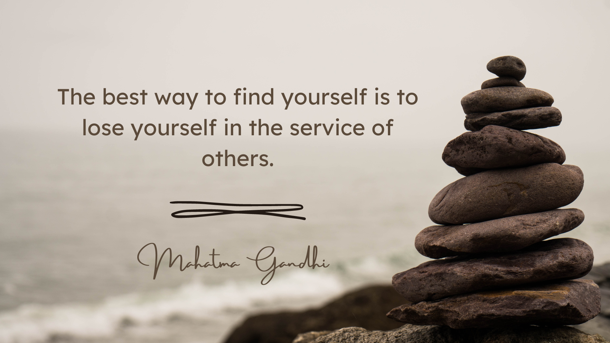

# Reflection

## Design Process
During the development of CharitAble, our team embraced a comprehensive design process rooted in design thinking principles. We started with empathy by meeting our client, understanding their needs, and identifying pain points in existing donation platforms. The ideation phase involved brainstorming innovative features to enhance user engagement and simplify the donation process. Through iterative prototyping, we gathered valuable user feedbacks, enabling us to refine our design. By adopting this user-centered approach, we created a platform that is intuitive and delightful, encouraging users to contribute to charitable causes seamlessly.

## User Feedback
User feedback played a pivotal role in shaping the final version of CharitAble. Through extensive testing, we gained valuable insights into user preferences, pain points, and usability issues. Their feedback allowed us to identify areas for improvement and make necessary adjustments to the website's functionality and design. Based on their suggestions, we refined the donation suggestion interface, tailoring to different user needs. Embracing this feedback-driven development approach, we effectively have built a platform that resonates with users and addresses their specific needs.

## Challenges and Solutions
While developing CharitAble, we encountered several challenges that pushes out of our comfort zone and thereby coming out with creative solutions. One major hurdle was ensuring the donation process was simple enough. The team wanted a 3 step process but soon realised that smaller steps does not mean its simple. We resolved this issue by considering user feedbacks and redefined what it means to be simple. Simple to us means breaking something complex into manageable steps. This meant additional steps but the users are delighted with the simple to follow steps. By meeting these challenges head-on, we developed an innovative donation platform that promotes trust, delightfulness, and simplicity.

## Impact on Society
CharitAble has the potential to make a substantial impact on society by simplifying and encouraging charitable giving. With the integration of personalised donation suggestions based on users' data, we removed barriers and inspire individuals to contribute to causes they are passionate about. By streamlining the donation process, CharitAble can increase overall giving and amplify the positive effect on various charitable organisations. Ultimately, the platform strives to promote a culture of philanthropy, reaching a broader community to address societal challenges and foster positive change.
## Learning from Failures
Throughout the development of CharitAble, we encountered moments of setbacks and challenges. However, these moments have provided invaluable learning opportunities. From a technical standpoint, we learned the importance of rigorous testing and quality assurance to catch and address potential issues early on. Moreover, we recognized that user engagement and feedback are vital for continuous improvement and better user experiences. Embracing these lessons, we are better prepared to tackle future projects with resilience, adaptability, and a commitment to delivering exceptional products. Technology are ultimately made for humans and we are simply enlightened wizards that make it happen. A high touch and high thought approach is therefore necessary to make ideas come alive.

## Personal Growth
Participating in the development of CharitAble has been a transformative experience for the team as a computing science students. The collaborative nature of the project has improved the team's teamwork and communication abilities, fostering effective collaboration among us. Witnessing the positive impact CharitAble could have on charitable causes has instilled a sense of purpose and motivation in our journey as a computing professionals. This project has been a catalyst for all our personal growth, empowering us with newfound knowledge and skills applicable across various domains.

After taking this design and innovation module, the team is poised with confidence, a growth mindset and a willingness to experiment with designing our future. The team is deeply heartened by the commitment given by our professor, Jonathan Grizou (his website is in the footer), and the ooportunity to work with Barclays bank. What we have found, learnt and picked up here, we are sure will forever live in our souls.

If a quote can sum up 6 students journey in Glasgow, it would be this:

