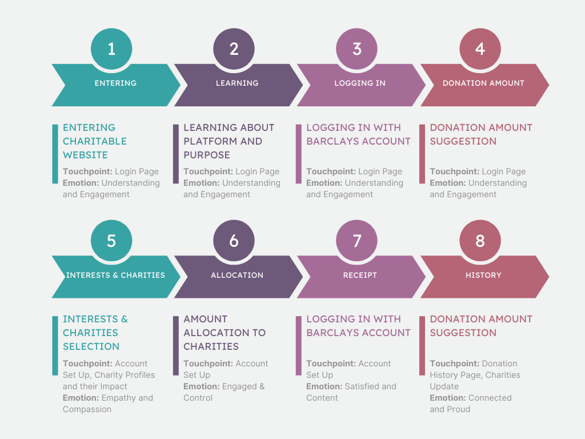

# User Journey Mapping
After creating prototypes to explore and validate specific features and interactions within CharitAble such as the donation process, the team moves on to user journey mapping to gain a comprehensive understanding of the entire user experience which includes the various screens of the application. Let's now discover the journey a user will embark on. This will help with gaining insight into the user experience by understanding the various touchpoints and the emotions to be invoked which will enhance user satisfaction and engagement.

