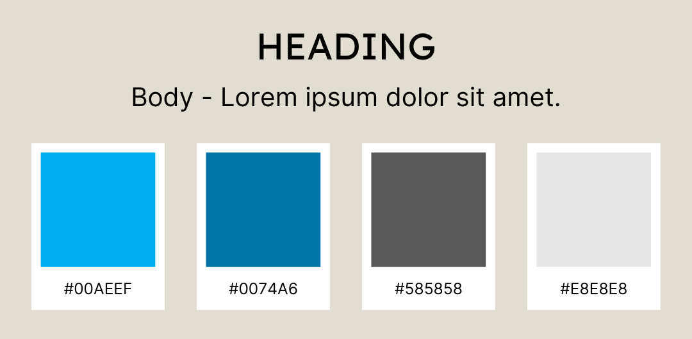
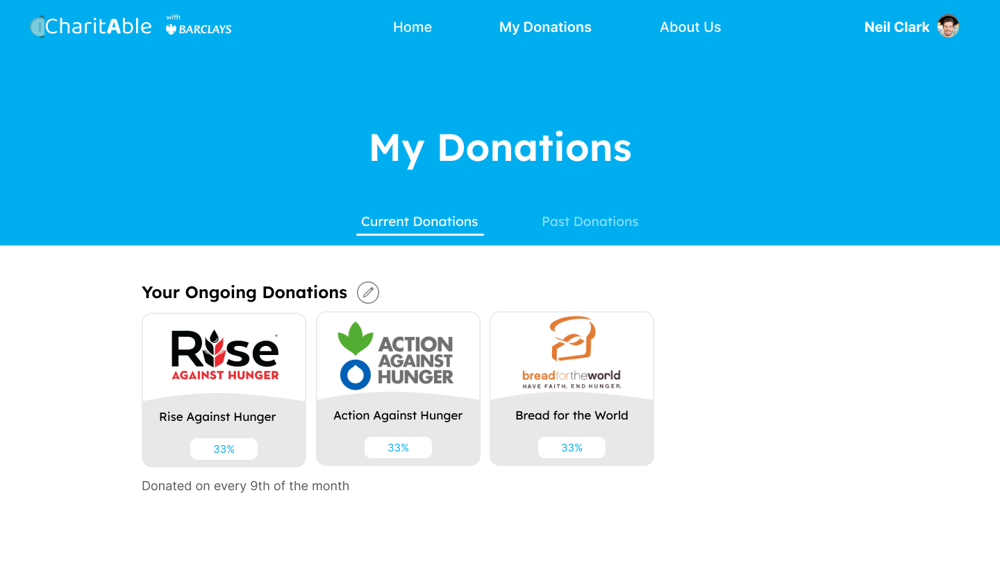
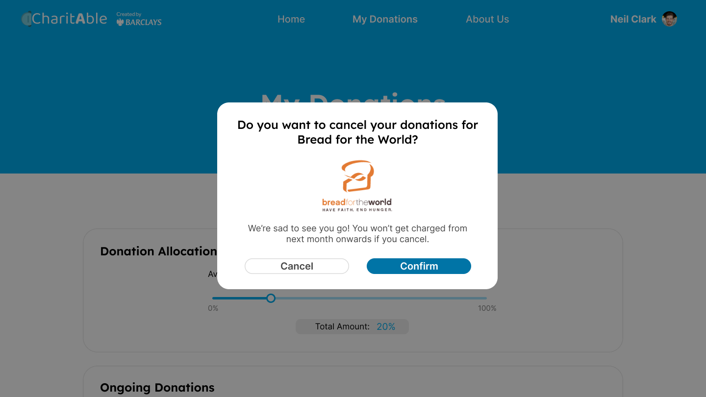
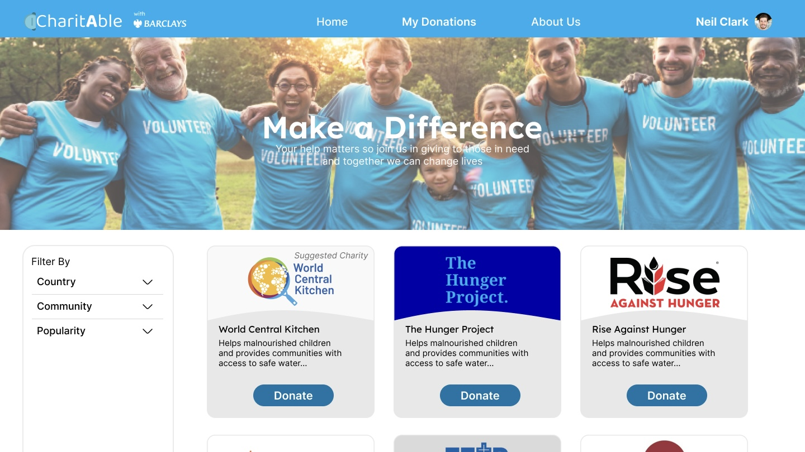

# Visual Design
Moving on to the actual design of the website; colour scheme, typography and imagery are explored to create a visually appealing and emotionally engagging platform. This will encourage users to participate on charitable giving as well as emphasising the simplicity of CharitAble and reliability of Barclays.

## Colour Scheme

- **Light Blue (#00AEEF):** This refreshing and serene light blue color represents a sense of tranquility and harmony. It evokes feelings of trust and reliability, fostering a sense of security and confidence within the application. As users browse through the platform, this color will instill a feeling of calmness and ease, encouraging them to engage with the charitable causes showcased.

- **Dark Blue (#0074A6):** This deeper shade of blue is used for interactive elements such as buttons and clickable elements. It adds a touch of vibrancy and excitement, guiding users towards taking action and making donations. The buttons' blue helps create a clear visual contrast, drawing attention to the important calls-to-action throughout the app.

- **Medium Grey (#585858):** A subtle, medium grey tone is chosen for the description texts throughout the app. This color strikes a balance between being readable and unobtrusive, allowing users to absorb information comfortably. The choice of this grey complements the vibrant blue hues, ensuring that essential information is presented clearly and concisely.

- **Light Grey (#E8E8E8):** The light grey color used for the charity icons exudes a sense of simplicity and sophistication. This neutral shade serves as a clean backdrop for the charity logos, allowing them to stand out prominently and maintain their individual identities. The light grey also contributes to an overall clean and organized appearance, enhancing the user experience.

The image above showcases the various colours used.

## Typography

- **Heading Font - Lexend:** Lexend is a contemporary and elegant font, perfect for CharitAble. With its unique letterforms and clear legibility, Lexend adds a touch of modernity and sophistication to the design. The slightly condensed letter spacing of Lexend ensures that headings are eye-catching and impactful, grabbing the users' attention as they explore the platform.

- **Body Font - Inter:** Inter is a highly readable and versatile font, making it an excellent choice for the main body text of CharitAble. Its balanced and neutral appearance allows for easy comprehension, ensuring that users can comfortably engage with the content and information presented on the app. Inter's clear letterforms and consistent spacing contribute to a smooth reading experience, making it suitable for the web interface.

The image above shows the clear separation of heading and description, guiding the user.

## Imagery
The imagery used focuses on showcasing positive impact through charitable actions. We utilise photographs that evoke emotions of happiness, hope and unity. The image used are:
- **Diverse and Inclusive Photos:** Showing people from various backgrounds, cultures and ages engaging in acts of kindness, charity events and volunteering events.

- **Nature and Environment:** Illustrates the impact of environmental charities, such as images of lush landscapes, clean oceans or wildlife conservation efforts.

- **Supportive Community:** Depict images of people coming together, forming a supportive community to empahsise the power of collective giving.

- **Smiling Faces:** Highlight the joy of giving and receiving by capturing genuine smiles and expressions of gratitude.

The image above showcases the attributes of a photo used.

## View Our Final Design on Figma!
You can view our final design below or if you would like to view it in the Figma app, simply click the link provided at the end.

  <iframe
    src="https://www.figma.com/embed?embed_host=share&url=https%3A%2F%2Fwww.figma.com%2Ffile%2FE77zN6Nmwc14UuebMuBXQ2%2FAuto-Donate-Web%3Ftype%3Ddesign%26node-id%3D0%253A1%26mode%3Ddev"
    allowFullScreen
    style={{ position: 'absolute', top: '0', left: '0', width: '100%', height: '100%' }}
  ></iframe>

https://tinyurl.com/Team6BVisualDesign